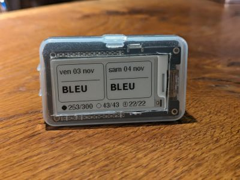

# Affichage TEMPO EDF sur E-Ink avec ESP32

## 📝 Description Générale

Ce dépôt contient le code source pour un dispositif qui affiche les informations relatives au tarif TEMPO d'EDF sur un écran E-Ink, en utilisant un microcontrôleur ESP32. Le dispositif récupère les données TEMPO en temps réel via une API et affiche la couleur du jour et du lendemain, ainsi que le nombre de jours restants pour chaque couleur TEMPO.

## ⚡ Consommation Énergétique Réduite

Le projet est conçu pour une efficacité énergétique optimale. Grâce à l'utilisation d'un écran E-Ink et au mode sommeil profond de l'ESP32, la consommation d'énergie est minimisée.

## 🌐 Connexion WiFi avec WiFiManager

Pour la configuration initiale du réseau WiFi, le dispositif utilise WiFiManager, qui permet de saisir facilement les informations de connexion via un portail captif. Si le dispositif ne peut se connecter à un réseau connu, il crée un point d'accès auquel vous pouvez vous connecter pour configurer les détails du réseau WiFi.

Pour plus d'informations sur WiFiManager, visitez [WiFiManager GitHub](https://github.com/tzapu/WiFiManager).

## ⏰ Heures de Réveil Préprogrammées

Le dispositif est programmé pour se réveiller à deux moments précis chaque jour : à 00h05 et à 11h05. Cela permet de synchroniser l'heure via NTP et de mettre à jour l'affichage avec les informations TEMPO les plus récentes, tout en restant en sommeil profond le reste du temps pour économiser de l'énergie.

## 🖥️ Matériel Utilisé

- **Board ESP-32 E-Ink**: T5 V2.3.1 - Écran E-Paper 2.13 pouces à faible consommation d'énergie
  - [Lien vers le produit](https://www.lilygo.cc/products/t5-v2-3-1)
- **Batterie**: Lithium Polymère 3,7V 820mAh

## 📄 Licence

Ce projet est distribué sous la licence GNU General Public License v3.0. Pour plus de détails, veuillez consulter le fichier `LICENSE` dans ce dépôt.

---

## Contribution

Les contributions à ce projet sont les bienvenues. Si vous souhaitez contribuer, veuillez suivre les directives de contribution standards pour les projets GitHub.

## Support et Contact

Pour le support ou pour entrer en contact, veuillez ouvrir un ticket dans la section issues du dépôt GitHub.
